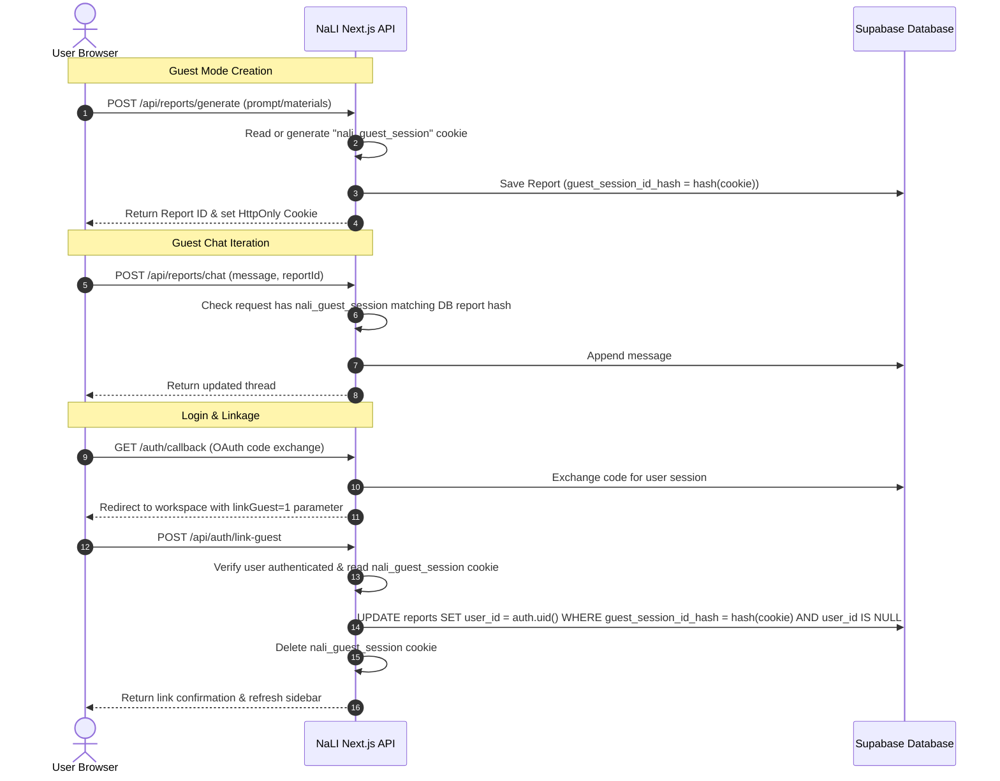

# Architecture: NaLI Auth & Guest Persistence Linking

This document details the architectural design of the session persistence, guest workspace continuity, and authenticated user thread linking.

## Architectural Overview

NaLI utilizes a hybrid guest-first architecture. A user is allowed to generate reports and engage in continuous chat/revision sessions in "Guest Mode" without immediately registering an account. This reduces initial friction while keeping the generated materials secure. When a guest decides to login or register, their guest session history is transferred/linked to their newly authenticated account.

---

## Security Safeguards

To prevent session hijackings, cross-user takeovers, or prompt spoofing, the following policies are strictly enforced:

1. **HttpOnly Cookies**: The `nali_guest_session` is managed as an `HttpOnly`, `Secure`, `SameSite=Lax` cookie. The client-side JavaScript cannot read or modify the raw cookie value, preventing XSS and spoofing.
2. **Server-Side Verification**: Linking endpoints use the cookie value sent implicitly by the browser. The payload of the linking request does *not* accept arbitrary session IDs from the client body to prevent malicious users from linking other guests' reports to their accounts.
3. **Open Redirect Mitigation**: The `/auth/callback` endpoint filters the `next` query redirect parameter. Any URL that does not start with `/` or starts with `//` (protocol-relative redirection bypass) is discarded and falls back to `/create-report` to prevent phishing attacks.
4. **Idempotence**: The `/api/auth/link-guest` handler is fully idempotent. If a user triggers the linking process multiple times, it links reports, deletes the guest cookie, and returns a successful response without throwing errors.
